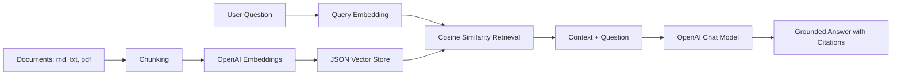

# Small RAG Gen AI Project

This is a recruiter-friendly Retrieval-Augmented Generation project in Python.
It reads `.txt`, `.md`, and `.pdf` files from `data/`, embeds them with OpenAI,
retrieves the most relevant chunks for a question, and generates grounded answers
with source citations.

It includes both:

- A command-line app for simple demos.
- A Streamlit web app with uploads, retrieval scores, and cited evidence.
- An enterprise-style FastAPI backend with multi-agent RAG, hybrid retrieval,
  memory, evaluation, analytics, auth, Docker, and AWS deployment notes.

## Files

- `app.py` - command-line RAG app.
- `streamlit_app.py` - interactive web UI.
- `enterprise/` - modular enterprise RAG backend.
- `enterprise_dashboard.py` - Streamlit dashboard for the FastAPI backend.
- `docs/enterprise-architecture.md` - system design and AWS deployment notes.
- `data/` - put your knowledge base files here.
- `vector_store.json` - generated after indexing.
- `.env.example` - environment variable template.
- `requirements.txt` - Python dependencies.
- `requirements-enterprise.txt` - optional enterprise dependencies.

## Setup

```powershell
python -m venv .venv
.\.venv\Scripts\Activate.ps1
pip install -r requirements.txt
Copy-Item .env.example .env
```

Open `.env` and set your `OPENAI_API_KEY`.

## Run

Index the sample document:

```powershell
python app.py index
```

Ask a question:

```powershell
python app.py ask "What does Acme Learning do?"
```

Try another:

```powershell
python app.py ask "What support do enterprise customers receive?"
```

## Run the Web Demo

```powershell
streamlit run streamlit_app.py
```

The web app lets you:

- Upload `.md`, `.txt`, and `.pdf` files.
- Rebuild the vector index.
- Ask questions over the indexed documents.
- Inspect retrieved chunks and similarity scores.
- See citations in the generated answer.

## Run the Enterprise API

Install the enterprise dependencies:

```powershell
pip install -r requirements-enterprise.txt
```

Start FastAPI:

```powershell
python -m uvicorn enterprise.api:app --reload
```

Open the interactive API docs:

```text
http://localhost:8000/docs
```

Use this header for protected endpoints:

```text
X-API-Key: dev-local-key
```

Privacy note: ingestion sends document text to the embedding provider. Do not
ingest personal or confidential files unless you intend to process them with the
configured model provider.

Run the enterprise dashboard in another terminal:

```powershell
streamlit run enterprise_dashboard.py
```

## How It Works

1. Loads Markdown, text, and PDF files from `data/`.
2. Splits documents into overlapping chunks.
3. Creates embeddings for each chunk.
4. Saves a simple JSON vector store.
5. Embeds the user question.
6. Retrieves the most similar chunks with cosine similarity.
7. Sends the retrieved context to a chat model to generate a grounded answer.

## Architecture



## Recruiter Talking Points

- Built a complete RAG pipeline from document ingestion to answer generation.
- Expanded it into a multi-agent enterprise architecture with Research,
  Citation, and Answering agents.
- Added hybrid retrieval with BM25, vector search, and reranking.
- Added transparent retrieval with source citations and similarity scores.
- Supports multiple document formats, including PDFs.
- Provides CLI, Streamlit UI, FastAPI API, and evaluation dashboard experiences.
- Keeps secrets out of Git with `.env` and `.gitignore`.
- Includes ChromaDB and FAISS integration points, Docker, PostgreSQL scaffolding,
  auth, analytics, and AWS deployment notes.

## Demo Assets

- `linkedin_post.md` contains a ready-to-edit LinkedIn learning post.
- `assets/rag_demo_output.gif` is a short visual demo for sharing the result.
- `create_demo_gif.py` regenerates the demo GIF.

## Notes

- Add your own `.md`, `.txt`, or `.pdf` files to `data/`, then rerun
  `python app.py index` or use the web app's Rebuild Index button.
- Change models in `.env` with `RAG_EMBEDDING_MODEL` and `RAG_CHAT_MODEL`.
- This is intentionally small and readable. For production, use a real vector
  database, add tests, handle larger files, and store metadata more carefully.
